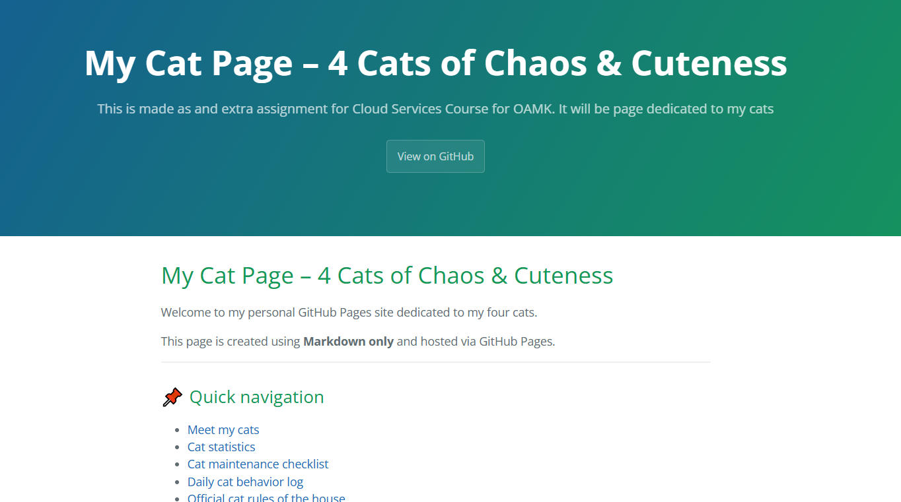

# My Cat GitHub Pages Project

This repository contains a simple static website hosted using **GitHub Pages**.

The site is written entirely in **Markdown (GitHub Flavored Markdown)** and does not use HTML for layout.

---

## 🌐 Live site

👉[Visit live site](https://taramariat.github.io/cloud-service-extra-assignment-E/)

---

## 📌 Project description

This project was created as part of the **OAMK Cloud Services Course**.

It demonstrates:
- Static site hosting using GitHub Pages
- Markdown formatting capabilities
- Basic documentation structure
- Use of GitHub Flavored Markdown features

---

## Content

The website is a themed page about my four cats:

- Shura
- Gin
- Ren
- Vili

It includes:
- Images
- Tables
- Lists
- Navigation links
- Collapsible sections
- Fun cat-themed content

---

## Technologies used

- GitHub Pages
- Markdown (GitHub Flavored Markdown)
- Jekyll (Cayman theme)

---

## Screenshots

---

## 📖 Notes

The project intentionally avoids HTML in the main content to demonstrate Markdown-based documentation.

---

## 📅 Last updated

2026-04-23
