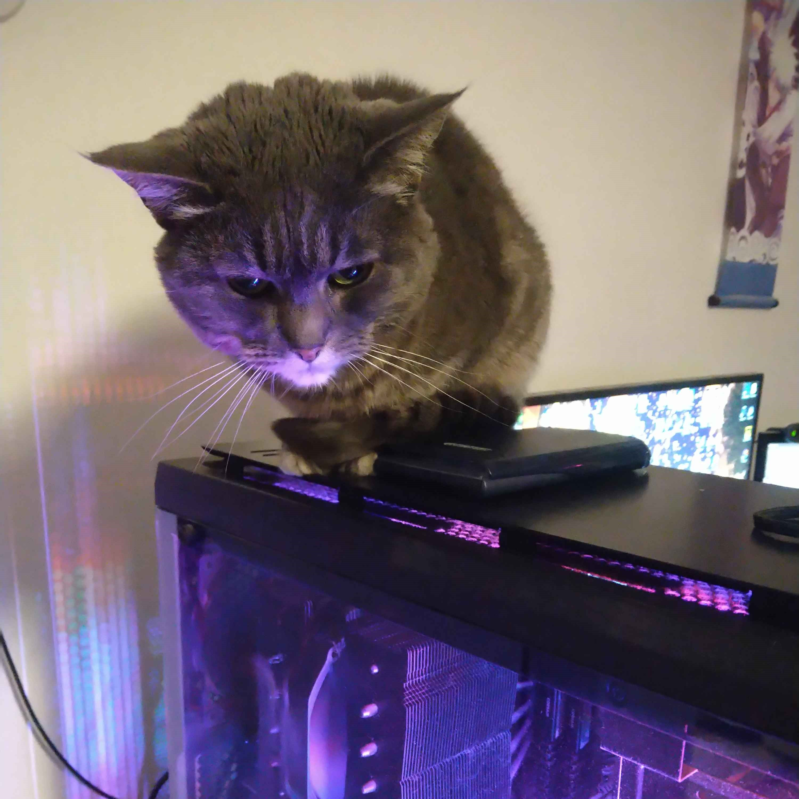
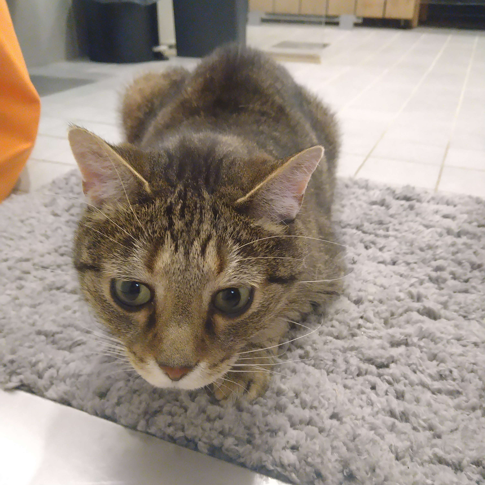
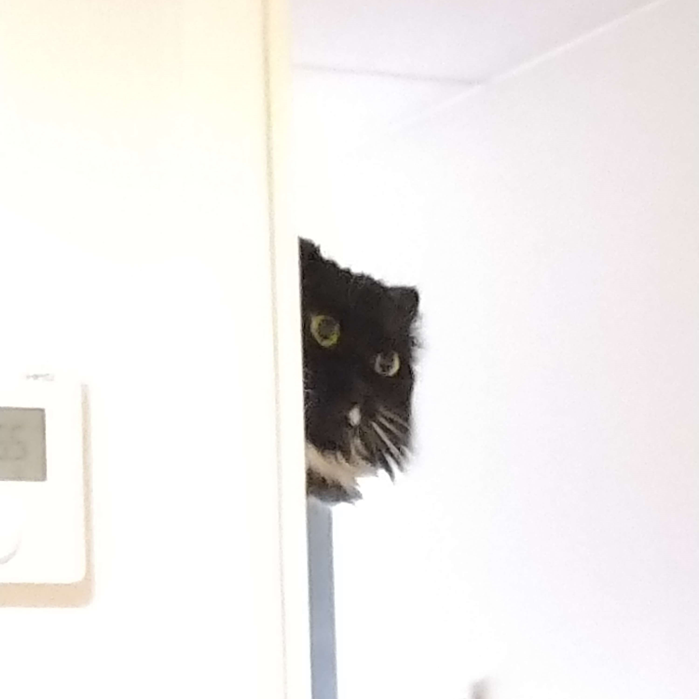
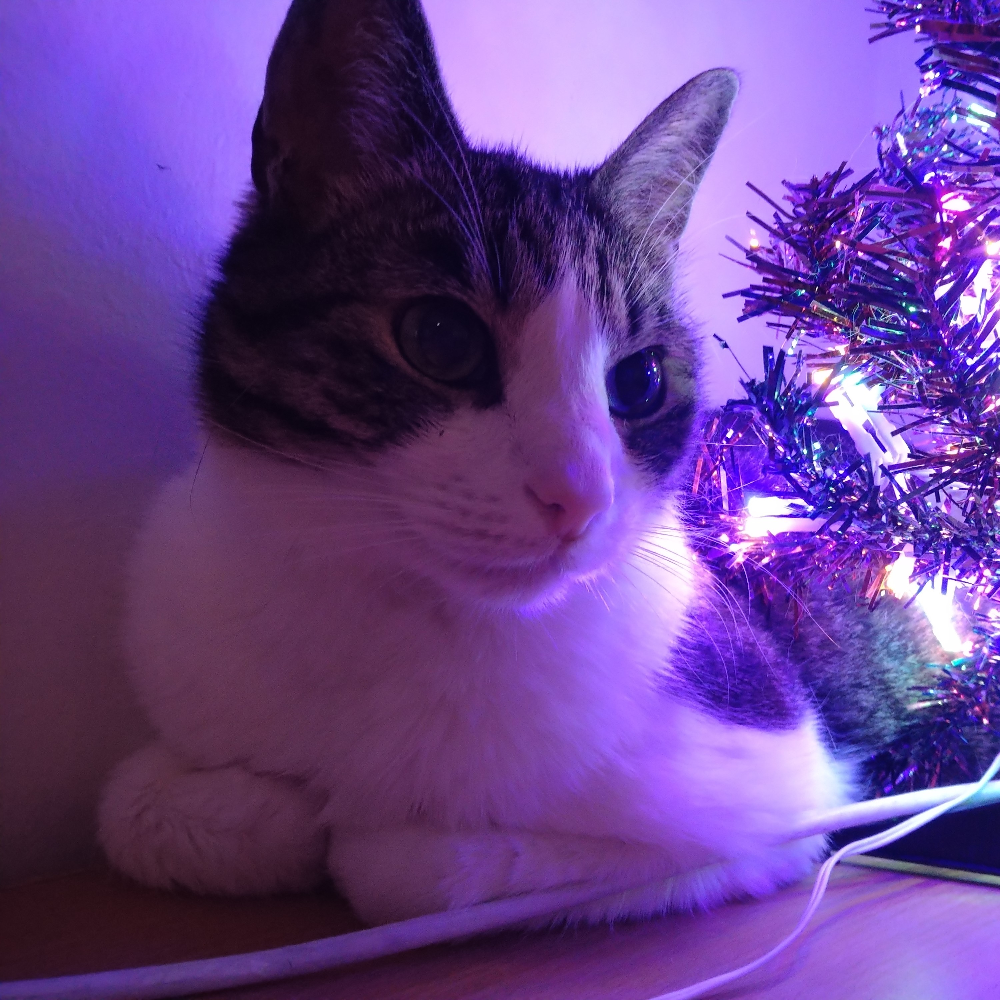

# My Cat Page – 4 Cats of Chaos & Cuteness

Welcome to my personal GitHub Pages site dedicated to my four cats.

This page is created using **Markdown only** and hosted via GitHub Pages.

---
## 📌 Quick navigation
- [Meet my cats](#meet-my-cats)
- [Cat statistics](#cat-statistics-totally-scientific)
- [Cat maintenance checklist](#cat-maintenance-checklist)
- [Daily cat behavior log](#daily-cat-behavior-log)
- [Cat lore](#cat-lore)
- [Useful cat resources](#useful-cat-resources)
- [Final note](#-final-note)

---

## 🐾 Meet my cats

I have four cats, each with their own personality:

### Shura

- Personality: crumpy looking but affectionate
- Favorite activity: sleeping on router, playing
- Fun fact: She HAS to go to the toilet with you otherwise she'll meow sadly behind the door

🐾━━━━━━━━━━━━━━━━━━━━━━━━━━━━🐾

### Gin

- Personality: Dumb but cute
- Favorite activity: Staring into the distance
- Fun fact: He NEEDS to sit and sleep in every box

🐾━━━━━━━━━━━━━━━━━━━━━━━━━━━━🐾

### Ren

- Personality: Lazy and bit of a scaredy-cat
- Favorite activity: Eating and playing
- Fun fact: Despite being youngest of the cats, she's the largest

🐾━━━━━━━━━━━━━━━━━━━━━━━━━━━━🐾

### Vili

- Personality: Loud
- Favorite activity: Snack time
- Fun fact: Oldest

---

## Cat statistics (totally scientific)

| Cat | Energy level | Cuteness | Chaos factor |
|-----|-------------|----------|--------------|
| Shura | High | ⭐⭐⭐⭐⭐ | High |
| Gin | High | ⭐⭐⭐⭐⭐ | High |
| Ren | Low | ⭐⭐⭐⭐⭐ | Medium |
| Vili | Medium | ⭐⭐⭐⭐⭐ | Medium |

---

## Cat maintenance checklist

- [x] Feed cats
- [x] Clean litter box
- [ ] Buy new snacks
- [ ] Survive zoomies at 3 AM

---

## 🌙 Daily cat behavior log

> "Cats are mysterious creatures that pretend they don’t care, but secretly rule the house."

- Morning: sleeping 90% of the time
- Afternoon: sudden zoomies
- Evening: judging humans silently
- Night: chaos mode activated

---

## Cat lore

Once upon a time, four cats moved in.
The humans thought they owned the apartment.
They were wrong.

---

🔍 Secret cat facts (click to open)

- Shura is secretly the boss.
- Gin has two braincells fighting for 3rd place.
- Ren is large and in charge.
- Vili screams for snacks like it's a full-time job.

---

## Useful cat resources

- [Wikipedia: Cat](https://en.wikipedia.org/wiki/Cat)
- [The International Cat Association](https://tica.org/)

---

## 📝 Markdown features used in this project

- # Headings
- Lists (-)
- Tables
- Blockquotes (>)
- Emphasis (**bold text**)
- Structured sections

---

## ✅ Final note

All cats approve this website. Probably.

## ℹ️ Additional info

This page was made as a part of OAMK Cloud Services Course.

Thanks for visiting!
